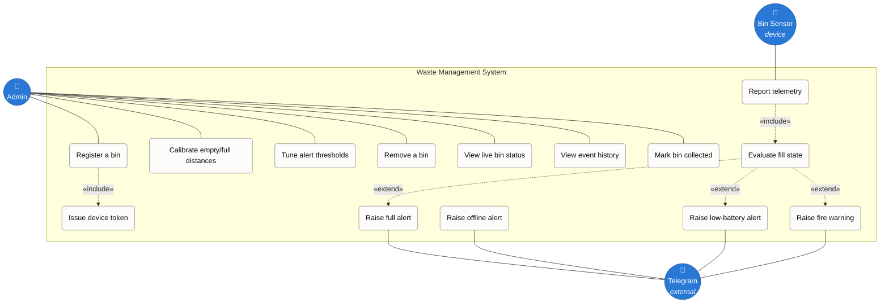

# Use Case Diagram

Who uses the system and what they can do with it.

There are three actors. The **Admin** is the only human who operates the
software. The **Bin Sensor** is a device actor — it initiates telemetry on its
own schedule rather than being driven by a person. **Telegram** is an external
system actor that receives outbound alerts.

Note that the Collector never touches the software: they are notified through
the Admin and confirm collection indirectly, either by the sensor observing the
level drop or by the Admin pressing "Mark collected". Adding a collector-facing
app would be a future change, not a current capability.

The use cases group into three areas:

| Area | Use cases |
|---|---|
| **Fleet management** | Register a bin · Issue device token · Calibrate · Tune thresholds · Remove |
| **Monitoring** | View live status · View event history · Report telemetry · Evaluate fill state |
| **Response** | Mark collected · Raise full / offline / low-battery / fire alerts |

## Notes on the relationships

**Issue device token** is `«include»`d in *Register a bin* because it always
happens as part of registration — the token is generated and displayed exactly
once, and cannot be retrieved afterwards.

**Evaluate fill state** is `«include»`d in *Report telemetry* because every
reading runs through the state machine. The alerts hanging off it are
`«extend»` rather than `«include»`: they only occur when their conditions are
met, which for a full-bin alert means three consecutive confirmations, not a
single high reading.

*Receive offline alert* is deliberately not connected to the sensor. It fires
precisely because the sensor said nothing — it is raised by a timer sweep on
the server, which is what makes a silently dead sensor detectable.
