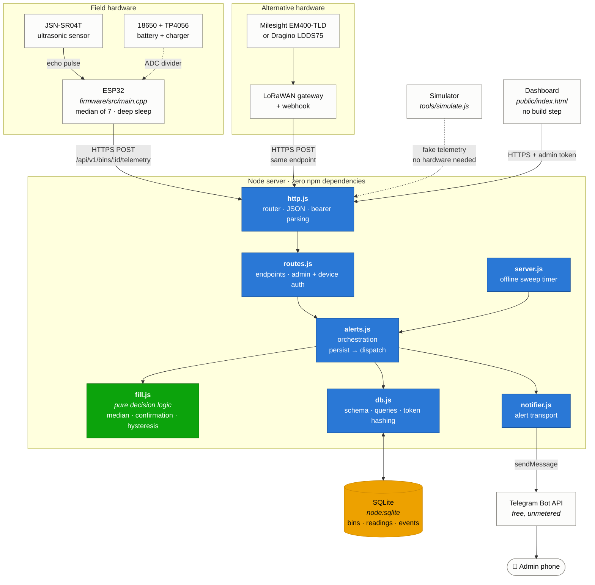

# Architecture Diagram

How the parts fit together, and which file does what.

The shape to notice: **`fill.js` sits at the centre but touches nothing.** It
has no database access, no network calls, and no clock — time is passed in as
an argument. Everything it needs arrives as parameters and everything it
decides comes back as a return value. That is what makes the decision logic
exhaustively testable without mocks, and it is the main structural difference
between this and a typical bin-monitor project where threshold checks are
scattered through request handlers.

## Layer responsibilities

| Layer | Files | Responsibility |
|---|---|---|
| **Device** | `firmware/` | Measure, filter outliers, sleep. Sends a median, never a raw ping. |
| **Transport** | — | HTTPS with a per-bin bearer token. LoRaWAN webhooks post to the identical endpoint. |
| **API** | `http.js`, `routes.js` | Routing, authentication, request validation. |
| **Orchestration** | `alerts.js` | Calls the pure logic, then persists and dispatches what it returns. |
| **Decision** | `fill.js` | *Pure.* All fill-state, battery, temperature and offline decisions. |
| **Storage** | `db.js` | SQLite schema and queries. Tokens stored as SHA-256 hashes only. |
| **Notification** | `notifier.js` | Telegram delivery. Failures are logged, never propagated. |
| **Client** | `public/index.html` | Dashboard. Plain HTML/JS, no build toolchain. |

## Two deliberate choices

**Alert delivery cannot break ingestion.** `notifier.js` swallows its own
failures and returns a boolean. If Telegram is down, the reading is still
stored and the event row is still written — just with `notified = 0`. Losing a
notification is recoverable; losing the data is not.

**The offline sweep is a timer, not a request handler.** It has to be, because
it detects the *absence* of traffic. No incoming request can trigger it, so it
runs on an interval from `server.js` and calls the same `alerts.js` dispatch
path as everything else.
