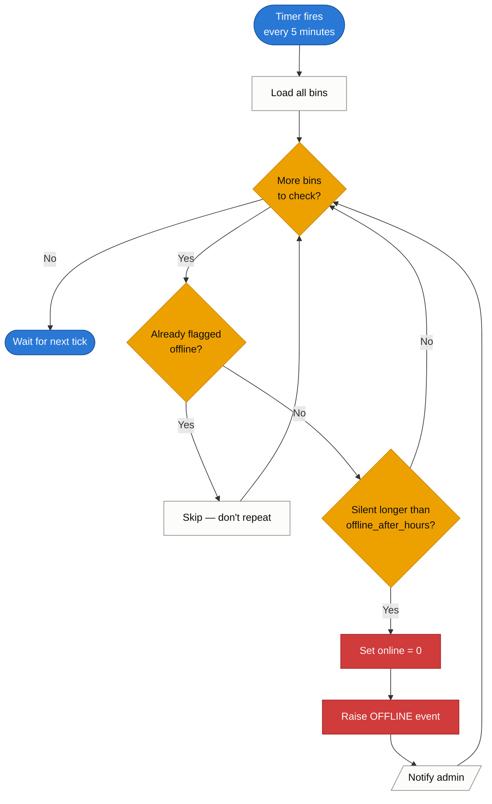
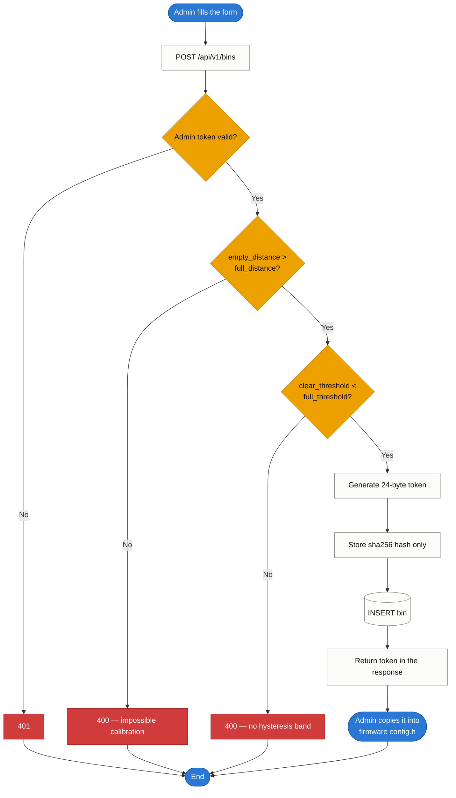

# Flowchart

The processing logic, from the sensor waking up to the admin's phone buzzing.

## 1. Main cycle — one wake, one reading

This is the complete path a single reading takes. The branch that matters most
is near the bottom: **a high reading does not produce an alert.** It increments
a counter, and only the third consecutive confirmation crosses into `FULL`.
That one decision is what separates a system people trust from one they mute.

```mermaid
flowchart TD
    start([Wake from deep sleep]) --> sample[/"Take 7 ultrasonic samples"/]
    sample --> med["Compute median<br/>— discards outliers"]
    med --> valid{"At least 4<br/>valid samples?"}

    valid -->|No| deadsensor["Sensor dead, flooded<br/>or unplugged"]
    deadsensor --> sleep([Deep sleep])

    valid -->|Yes| batt[/"Read battery voltage<br/>— before WiFi powers on"/]
    batt --> wifi{"WiFi connects<br/>within 20s?"}
    wifi -->|No| sleep
    wifi -->|Yes| post[/"POST telemetry<br/>with device token"/]

    post --> auth{"Token matches<br/>this bin?"}
    auth -->|No| reject401["401 unauthorized"] --> sleep
    auth -->|Yes| plaus{"Distance plausible?<br/>0 < d ≤ 10000mm"}
    plaus -->|No| reject400["400 rejected"] --> sleep

    plaus -->|Yes| level["Convert distance → level %<br/>using this bin's calibration"]
    level --> store[("Store reading")]
    store --> wasoff{"Was the bin<br/>marked offline?"}
    wasoff -->|Yes| online["Raise ONLINE"] --> band
    wasoff -->|No| band

    band{"Where does the<br/>level sit?"}
    band -->|"≥ 85% (full threshold)"| inchigh["consecutive_high += 1<br/>consecutive_low = 0"]
    band -->|"≤ 40% (clear threshold)"| inclow["consecutive_low += 1<br/>consecutive_high = 0"]
    band -->|"between the two<br/>— the dead band"| reset["Reset both counters<br/>— confirms nothing"]

    inchigh --> checkfull{"State is OK<br/>AND high ≥ 3?"}
    checkfull -->|Yes| raisefull["State → FULL<br/>Raise FULL alert"]
    checkfull -->|No| checkremind

    inclow --> checkempty{"State is FULL<br/>AND low ≥ 3?"}
    checkempty -->|Yes| raiseempty["State → OK<br/>Raise EMPTIED"]
    checkempty -->|No| checkremind

    reset --> checkremind
    checkremind{"Still FULL and<br/>uncollected past<br/>repeat_alert_hours?"}
    checkremind -->|Yes| remind["Raise STILL_FULL reminder"]
    checkremind -->|No| checkbatt

    raisefull --> checkbatt
    raiseempty --> checkbatt
    remind --> checkbatt

    checkbatt{"Battery low and<br/>not already alerted?"}
    checkbatt -->|Yes| lowbatt["Raise LOW_BATTERY<br/>set latch"]
    checkbatt -->|No| checktemp
    lowbatt --> checktemp

    checktemp{"Temperature ≥ 60°C<br/>and not already alerted?"}
    checktemp -->|Yes| hot["Raise HIGH_TEMP<br/>— possible fire"]
    checktemp -->|No| anyev
    hot --> anyev

    anyev{"Any events raised?"}
    anyev -->|No| respond["202 — reading stored,<br/>nothing to report"]
    anyev -->|Yes| persistev[("Write event rows")]
    persistev --> send[/"Send to Telegram"/]
    send --> ok{"Delivered?"}
    ok -->|Yes| mark["Mark notified = 1"] --> phone(["📱 Admin notified"])
    ok -->|No| logfail["Log failure —<br/>data is still safe,<br/>event stays notified = 0"]
    phone --> respond
    logfail --> respond
    respond --> sleep

    classDef term fill:#2a78d6,stroke:#184f95,color:#fff
    classDef dec fill:#eda100,stroke:#c98500,color:#0b0b0b
    classDef alert fill:#d03b3b,stroke:#a02020,color:#fff
    classDef good fill:#0ca30c,stroke:#006300,color:#fff
    classDef data fill:#fcfcfb,stroke:#898781,color:#0b0b0b

    class start,sleep,phone term
    class valid,wifi,auth,plaus,band,checkfull,checkempty,checkremind,checkbatt,checktemp,anyev,ok,wasoff dec
    class raisefull,remind,lowbatt,hot alert
    class raiseempty,online,mark good
    class store,persistev,sample,batt,post,send,med data
```

## 2. Offline sweep

Runs on a timer, not on a request — it has to, because it detects the
*absence* of traffic. A sensor that dies silently is the worst failure mode,
since everyone assumes the bin is fine.

## 3. Registering a bin

Short, but worth drawing because of the one-way door in the middle: the device
token is shown exactly once and only its hash is kept. Lose it and the bin must
be re-registered.

## Reading the main flowchart

Three things are worth tracing with a finger:

**The spike path.** A single stray echo enters at `band`, increments
`consecutive_high` to 1, fails the `high ≥ 3` test, and exits through
`anyev → No`. Nothing is sent. The next normal reading resets the counter to
zero. This is why a bag toppling over does not wake anybody up.

**The dead-band path.** A level of 60% is neither high nor low, so it resets
*both* counters. A bin drifting up and down in the middle cannot slowly
accumulate confirmations toward a false alert.

**The failure path.** If Telegram is unreachable, flow continues through
`logfail` to `respond`. The reading is stored and the event row exists with
`notified = 0`. Losing a notification is recoverable; losing the data is not.
