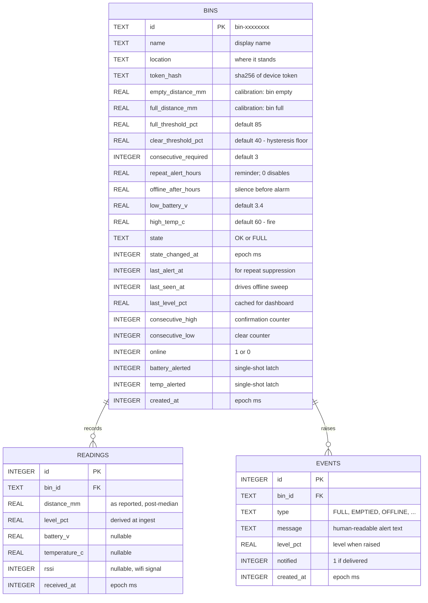

# Data Model (ER Diagram)

Three tables. The schema lives in [`src/db.js`](../../src/db.js).

The `bins` table is wider than you might expect because it carries three
distinct kinds of column: **configuration** (calibration and thresholds, set by
the admin), **live state** (the state machine's working memory), and
**identity**. Keeping the state machine's counters on the row is what lets the
decision logic stay pure — `applyReading()` receives the whole row, decides,
and returns a patch, without querying anything itself.

## Event types

The full set emitted by [`src/fill.js`](../../src/fill.js):

| Type | Raised when |
|---|---|
| `FULL` | Level confirmed above threshold for N consecutive readings |
| `STILL_FULL` | Reminder — full and uncollected past `repeat_alert_hours` |
| `EMPTIED` | Confirmed below the clear threshold, or marked by an admin |
| `OFFLINE` | No telemetry for `offline_after_hours` |
| `ONLINE` | A previously silent bin reports again |
| `LOW_BATTERY` | Battery at or below `low_battery_v` |
| `BATTERY_OK` | Recovered by a real margin, re-arming the alert |
| `HIGH_TEMP` | At or above `high_temp_c` — possible fire |

## Design notes

**`level_pct` is stored on each reading, not computed on read.** Calibration
can change, and a historical reading should keep the interpretation it had when
it was taken. Recalibrating changes future readings, not the past.

**Both `battery_alerted` and `temp_alerted` are latches, not booleans about the
current value.** They record *"we have already told someone"*, which is what
stops a bin on a dying cell from sending an alert every hour. Each re-arms only
after a genuine recovery margin — 0.15V for battery, 5°C for temperature — so a
value hovering exactly at the threshold cannot flap.

**Cascading deletes.** `ON DELETE CASCADE` with `PRAGMA foreign_keys = ON`
means removing a bin takes its readings and events with it.

**Retention.** `readings` grows without bound — one row per bin per wake cycle.
At hourly readings that is ~8,800 rows per bin per year, which SQLite handles
comfortably, but a long-running fleet deployment should add a pruning job.
